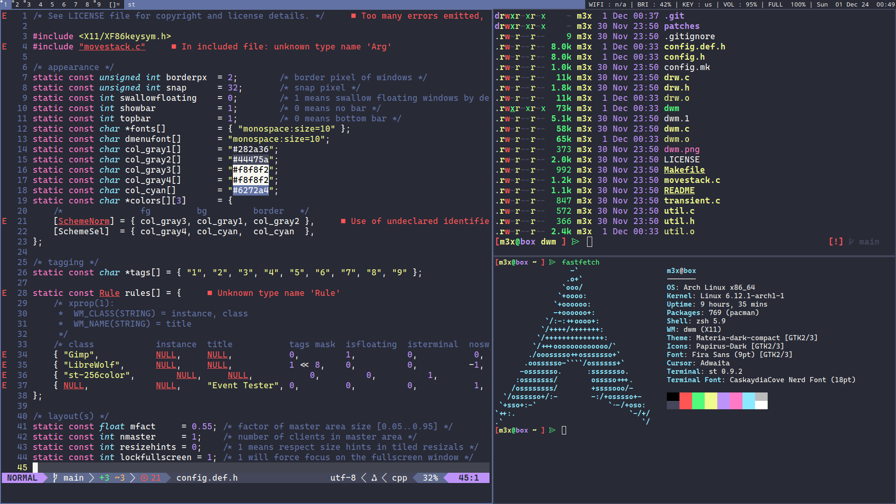

#  0xM3x's Dotfiles
Welcome to my dotfiles repository! This repo contains the configuration files and scripts that power my minimalist Linux desktop setup. If you’re a fan of efficient workflows, tiling window managers, and a beautiful terminal-based environment, you’ll feel right at home.

---

## 🖼️ Screenshot  
  

---
## ✨  What's Included  
- **Neovim Configuration**: Fully customized configuration in lua for a fast and modern coding experience.  
- **Zsh Configuration**: Includes configuration with custom aliases, plugins, and themes.  
- **Starship Config**: A blazing-fast, minimal prompt powered by [Starship](https://starship.rs).  
- **Custom Dmenu Build**: My personalized build of Dmenu with patches for improved usability.  
- **Custom Slstatus Build**: Status bar configuration tailored for my setup.  
- **Custom Slock Build**: A secure and minimalist screen locker.  
- **Scripts**: Handy custom scripts stored in the `bin/` directory.  
- **.xinitrc File**: Defines my session startup process, launching my window manager and essential utilities.  

---
## ⚒️  Requirements  
To use this dotfiles setup, ensure the following packages are installed on your system:

  - `libx11` - X11 client-side library  
  - `libxft` - FreeType-based font drawing library for X  
  - `libxinerama` - Xinerama extension for multi-monitor support  
  - `pamixer` - CLI tool for controlling PulseAudio volume  
  - `xorg-xbacklight` - Control screen brightness  
  - `npm`,`nodejs` and `yarn` - JavaScript runtime and package managers for plugin management  
  - `nvim` - Neovim, a modern and extensible Vim-based editor  

Install these packages using your distribution's package manager. For example:
### On Arch Linux:
```bash
sudo pacman -S libx11 libxft libxinerama npm nodejs yarn pamixer xorg-xbacklight neovim
```
### On Debian/Ubuntu:
```bash
sudo apt update && sudo apt install libx11-dev libxft-dev libxinerama-dev npm nodejs yarn pamixer xbacklight neovim
```
### On Void Linux:
```bash
sudo xbps-install -S libX11-devel libXft-devel libXinerama-devel npm nodejs yarn pamixer xbacklight neovim
```
---
## 🚀 Installation
### 1️⃣ Clone This Repository
```bash
git clone https://github.com/0xM3x/dotfiles.git
cd dotfiles
```

### 2️⃣ Install GNU Stow
GNU Stow is a symlink manager that makes managing dotfiles across different directories a breeze.
To install:

 - #### **On Debian/Ubuntu:**
```bash
sudo apt update && sudo apt install stow
```
 - #### **On Arch Linux:**
 ```bash
 sudo pacman -S stow
```
- #### **On Fedora:**
```bash
sudo dnf install stow
```
- #### **On Void Linux:**
```bash
sudo xbps-install -S stow
```

### 3️⃣ Symlink the Dotfiles
Use `stow` to create symlinks for the configurations you want to use. For example:
```bash
stow nvim      # Symlink Neovim configs
stow zsh       # Symlink Zsh configs
stow starship  # Symlink Starship config
stow xinitrc   # Symlink .xinitrc file
stow bin       # Symlink custom scripts
```
### 4️⃣  Clone DWM and ST Repositories
To complete the setup, clone my custom builds of `dwm` and `st`:
```bash
git clone https://github.com/0xM3x/dwm.git
git clone https://github.com/0xM3x/st.git
```
Build and install them:
```bash
cd dwm && sudo make clean install
cd st && sudo make clean install
```

## 📂 Directory Structure  
Here’s a quick overview of the directory structure:
```bash
dotfiles/
├── .config/
|        ├── nvim/ # Neovim configuration 
|        ├── zsh/ # Zsh configuration 
|        └── starship/ # Starship prompt configuration 
|
├── .local/
|        ├── src/ 
|        |    ├── dmenu/ # Custom dmenu build 
|        |    ├── slstatus/ # Custom slstatus build 
|        |    └── slock/ # Custom slock build 
|        |
|        └── bin/ # Custom scripts 
|             ├── aud # A script for slstatus that shows the current audio volume as a percentage using pamixer.
|             ├── bri # A simple script for slstatus that displays the current screen brightness as a percentage.
|             └── powerLock # A lightweight dmenu script for managing system power operations. 
└── xinitrc/ # .xinitrc file
```
---
## ⚡ Features
- **Lightweight and Minimalist:** Designed for speed and simplicity.
- **Highly Customizable:** Make it your own with just a few tweaks.
- **Perfect for Devs:** Includes tools and configurations tailored for developers.

---
## 🧩Recommended Tools
- **[Neovim](https://neovim.io)** - A modern Vim-based editor.
- **[Zoxide](https://github.com/ajeetdsouza/zoxide)** - A smarter cd command.
- **[Starship](https://starship.rs)** - Minimal, blazing-fast shell prompt.
- **[Exa](https://the.exa.website)** - A modern replacement for `ls` with better defaults and colors.

---
## 🤝 Contributing
Feel free to fork this repository and make it your own! If you have suggestions or improvements, don’t hesitate to open an issue or pull request.

---
## 📜License
This repository is licensed under the MIT License. See the `LICENSE` file for more details.

---
Happy hacking! 🚀 
